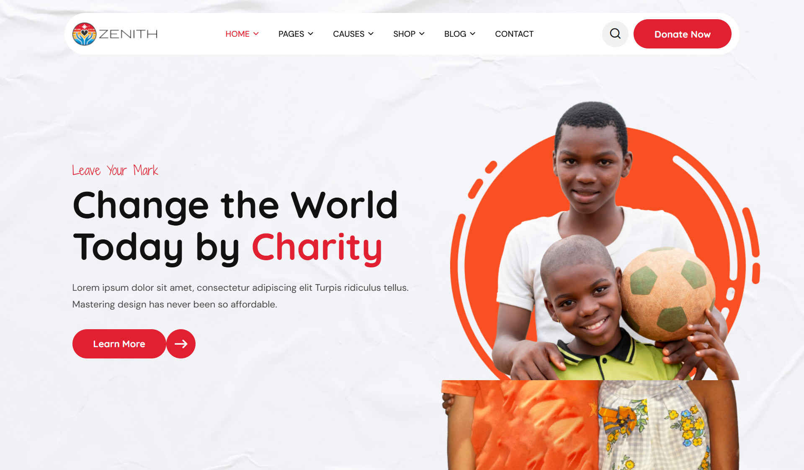

# Zenith - Free HTML Charity Template

[](https://opensource.org/licenses/MIT)
[](https://github.com/jaimepaezv/zenith-html-template/stargazers)
[](https://github.com/jaimepaezv/zenith-html-template/network/members)

<!-- Replace with a screenshot or demo link if available -->


## Description

**Zenith** is a free, open-source HTML template designed for **charity, non-profit organizations, and fundraising websites**. Built with HTML5, CSS3, and JavaScript, it provides a solid foundation for creating a professional and engaging online presence to promote your cause and encourage donations.

This template is **fully responsive**, ensuring it looks great on all devices, from desktops to tablets and smartphones. It comes packed with features and pre-designed sections to help you quickly set up your website.

**Key Features:**

*   **Modern and Clean Design:**  A visually appealing and professional layout to build trust and credibility.
*   **Fully Responsive:** Adapts seamlessly to different screen sizes for optimal viewing experience on any device.
*   **Multiple Home Page Variations:** Includes several pre-designed home page layouts (as seen in `index-2.html`, `index-3.html`, etc.) to choose from and customize.
*   **Pre-built Page Templates:**  Offers ready-to-use pages for:
    *   About Us
    *   Services
    *   Causes (with donation progress bars)
    *   Events
    *   Volunteer recruitment
    *   Testimonials
    *   Gallery
    *   Blog
    *   Shop
    *   Contact
    *   FAQ
    *   404 Error Page
*   **Donate Popup:** Integrated donation popup functionality to easily collect contributions.
*   **Search Popup:**  Convenient search functionality for website navigation.
*   **RTL & LTR Support:** Includes options for both Right-to-Left and Left-to-Right language layouts.
*   **Smooth Animations:**  Engaging animations powered by Animate.css and WOW.js to enhance user experience.
*   **Owl Carousel:**  Utilizes Owl Carousel for creating beautiful and responsive sliders and carousels.
*   **Fancybox:**  Implements Fancybox for a stylish image lightbox gallery.
*   **Odometer:**  Includes Odometer for animated number counters to showcase statistics and achievements.
*   **Google Fonts:**  Integrates with Google Fonts for easy customization of typography.
*   **Font Awesome & Flaticon Icons:**  Rich icon sets for visual enhancements.
*   **Well-Commented Code:**  Clean and well-structured HTML, CSS, and JavaScript code for easy customization.
*   **Free for Personal and Commercial Use:**  Use this template for any project without restrictions (under the MIT License).

## Demo

<!-- Replace with your live demo URL if you have deployed it -->
[**View Live Demo**](# *(Coming Soon)*

If you haven't deployed it yet, you can simply open the `index.html` file in your web browser after downloading to see the template locally.

## Installation

1.  **Download the Template:**
    *   **Clone the repository:**
        ```bash
        git clone https://github.com/jaimepaezv/zenith-html-template.git
        ```
        (Replace `jaimepaezv` with your GitHub username and `zenith-html-template` with your repository name if different)
    *   **Or download as ZIP:** Click on the "Code" button and then "Download ZIP" on the main repository page.

2.  **Extract (if downloaded as ZIP):** Unzip the downloaded file to your desired location on your computer.

3.  **Open in Browser:** Navigate to the extracted folder and open the `index.html` file in your web browser (e.g., Chrome, Firefox, Safari).

## Usage

1.  **Customize HTML Content:** Edit the HTML files (e.g., `index.html`, `about.html`, etc.) to replace the placeholder content with your own text, images, and information.

2.  **Modify Styles with CSS:**
    *   **`assets/css/style.css`:**  Contains the main styles for the template. Customize colors, fonts, layouts, and more.
    *   **`assets/css/color.css`:**  Focuses on color schemes. You can modify or create new color variations here.
    *   **`assets/css/module-css/`:**  Contains separate CSS files for different sections (header, banner, about, service, etc.). Edit these files to adjust the styling of specific modules.

3.  **Implement Functionality with JavaScript:**
    *   **`assets/js/script.js`:**  Contains the main JavaScript code for template functionalities, including carousels, popups, and more.
    *   **`assets/js/` (other JS files):** Includes libraries like jQuery, Bootstrap, Owl Carousel, etc.  Refer to the documentation of these libraries for advanced customizations.

4.  **Replace Assets:**
    *   **`assets/images/`:**  Replace the placeholder images with your own logos, banners, photos, etc.
    *   **`assets/css/font-awesome-all.css`, `assets/css/flaticon.css`:**  These are icon libraries. You can use icons from these libraries or replace them with your preferred icon sets.

5.  **Integrate with Backend (Optional):** If you need dynamic content, forms processing, or database integration, you will need to integrate this template with a backend system (e.g., using PHP, Python, Node.js, etc.).

## Credits

This template utilizes the following resources and libraries:

*   **Bootstrap:** [https://getbootstrap.com/](https://getbootstrap.com/)
*   **jQuery:** [https://jquery.com/](https://jquery.com/)
*   **Owl Carousel:** [https://owlcarousel2.github.io/OwlCarousel2/](https://owlcarousel2.github.io/OwlCarousel2/)
*   **Fancybox:** [https://fancybox.com/](https://fancybox.com/)
*   **Animate.css:** [https://animate.style/](https://animate.style/)
*   **WOW.js:** [https://wowjs.uk/](https://wowjs.uk/)
*   **Odometer:** [http://odometer.io/](http://odometer.io/)
*   **Nice Select:** [https://github.com/hernansartorio/jquery-nice-select](https://github.com/hernansartorio/jquery-nice-select)
*   **Google Fonts:** [https://fonts.google.com/](https://fonts.google.com/)
*   **Font Awesome:** [https://fontawesome.com/](https://fontawesome.com/)
*   **Flaticon:** [https://www.flaticon.com/](https://www.flaticon.com/)
*   **Images:** Images used in the demo are for preview purposes only and may be sourced from free image websites like Unsplash, Pexels, or Pixabay. Please replace them with your own images or appropriately licensed visuals for your project.

## License

This project is licensed under the **MIT License**.

You are free to use, modify, and distribute this template for both personal and commercial projects. See the `LICENSE` file in the repository for the full license text.

## Support and Contribution

For bug reports, feature requests, or general inquiries, please [open an issue](https://github.com/jaimepaezv/zenith-html-template/issues) on GitHub.

Contributions are welcome! If you'd like to contribute to the development of Zenith, please fork the repository and submit a pull request with your changes.

**Let's make the world a better place together!** ✨
